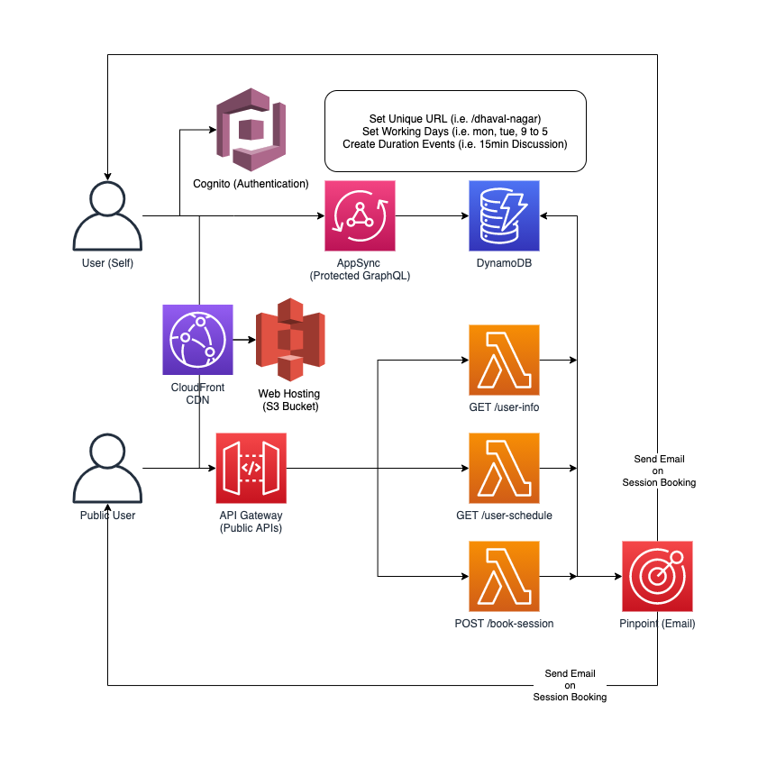

## Calendly Clone Frontend UI

This project is part of the [calendly-backend](https://github.com/AppGambitStudio/calendly-appsync) and you will have to update the configurations for `Amplify` to work.

## Setup

Go to the CloudFormation stack of the deployed [calendly-backend](https://github.com/AppGambitStudio/calendly-appsync) and collect the following values. 

```
const region = '';
const cognitoDomainName = ''
const cognitoPoolId = "";
const cognitoWebClientId = '';
const cloudfrontUrl = "";
const graphQlEndpoint = '';
const apiGatewayEndpoint = "";
```

Go to the [src/app.js](./src/app.js) and update the above variables.

## Build and Deploy

The setup is using Webpack for building the front-end assets. 

```
$ npm install
$ npm run build
$ npm run s3-sync <S3 bucket URI>
```

## Cleanup

If you need to remove the `calendly-backend` you will have to clean up the S3 Bucket first. 

```
npm run s3-clean <S3 bucket URI>
```